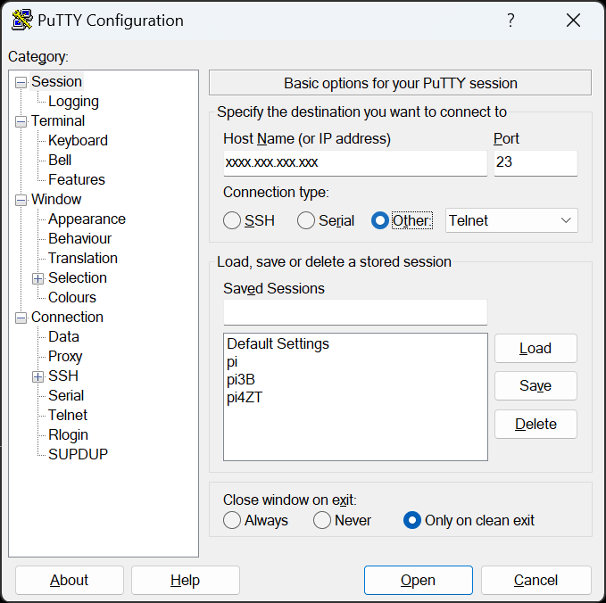

# Documentation of Telnet commands

State for v0.8.0

## How to connect

Use PuTTY



If you want to copy data from PuTTYY to your system use SHIFT key and select by mouse the text. 

If you want to paste data from your system to PuTTY use SFHIT+INSERT or right mouse click.

## Commands list

### 1. **OPEN-NETWORK**
- **Description**: Opens the Zigbee network for a specified duration.
- **Parameters**:
  - `time` (optional): Duration in seconds to keep the network open (default: 180 seconds).
- **Example**:
  ```
  OPEN-NETWORK 300
  ```

---

### 2. **VERSION**
- **Description**: Displays the gateway version.
- **Parameters**: None.
- **Example**:
  ```
  VERSION
  ```

---

### 3. **LIST-DEVICES**
- **Description**: Lists all devices in the Supla devices table.
- **Parameters**: None.
- **Example**:
  ```
  LIST-DEVICES
  ```

---

### 4. **LIST-ZB-DEVICES**
- **Description**: Lists all Zigbee devices in the Zigbee devices table.
- **Parameters**: None.
- **Example**:
  ```
  LIST-ZB-DEVICES
  ```

---

### 5. **LIST-CHANNELs**
- **Description**: Placeholder for listing channels (currently not implemented).
- **Parameters**: None.
- **Example**:
  ```
  LIST-CHANNELs
  ```

---

### 6. **REMOVE-CHANNEL**
- **Description**: Removes a channel from the devices table.
- **Parameters**:
  - `channel_id`: The ID of the channel to remove.
- **Example**:
  ```
  REMOVE-CHANNEL 5
  ```

---

### 7. **UPDATE-SED-TIMEOUT**
- **Description**: Updates the timeout for a sleepy end device (SED).
- **Parameters**:
  - `channel_id`: The ID of the channel.
  - `timeout`: Timeout value in hours.
- **Example**:
  ```
  UPDATE-SED-TIMEOUT 5 24
  ```

---

### 8. **UPDATE-DEVICE-TIMINGS**
- **Description**: Updates device timing parameters.
- **Parameters**:
  - `channel_id`: The ID of the channel.
  - `timing_type`: One of `"KEEPALIVE"`, `"TIMEOUT"`, or `"REFRESH"`.
  - `time`: Time in seconds.
- **Example**:
  ```
  UPDATE-DEVICE-TIMINGS 5 KEEPALIVE 3600
  ```

---

### 9. **UPDATE-DEVICE-RGB-MODE**
- **Description**: Updates the RGB mode of a device.
- **Parameters**:
  - `channel_id`: The ID of the channel.
  - `rgb_mode`: One of `"HS"`, `"XY"`, `"TUYA-HS"`, or `"TUYA-XY"`.
- **Example**:
  ```
  UPDATE-DEVICE-RGB-MODE 5 HS
  ```

---

### 10. **SET-TEMP**
- **Description**: Sets the temperature for a device.
- **Parameters**:
  - `channel_id`: The ID of the channel.
  - `temperature`: Temperature value multiplied by 100 (e.g., 2500 for 25.00°C).
- **Example**:
  ```
  SET-TEMP 5 2500
  ```

---

### 11. **UPDATE-DEVICE-DESC**
- **Description**: Updates the device description ID.
- **Parameters**:
  - `channel_id`: The ID of the channel.
  - `device_desc_id`: The new device description ID.
- **Example**:
  ```
  UPDATE-DEVICE-DESC 5 12345
  ```

---

### 12. **UPDATE-DEVICE-SID**
- **Description**: Updates the device sub-ID.
- **Parameters**:
  - `channel_id`: The ID of the channel.
  - `device_sub_id`: The new sub-ID.
- **Example**:
  ```
  UPDATE-DEVICE-SID 5 2
  ```

---

### 13. **UPDATE-DEVICE-FLAGS**
- **Description**: Updates device flags by setting or clearing a specific bit.
- **Parameters**:
  - `channel_id`: The ID of the channel.
  - `action`: `"SET"` or `"CLEAR"`.
  - `flag_bit`: The bit to set or clear (number or symbolic name). One of `FLAG_DISABLE_NOTIFICATIONS`,`FLAG_TRV_AUTO_TO_SCHEDULE`,`FLAG_IAS_MSG_DISABLED`

- **Description of flags**:
  -  FLAG_DISABLE_NOTIFICATIONS - disables notficiations when global notifications are enabled
  - FLAG_TRV_AUTO_TO_SCHEDULE - activates mode, in which enabling AUTO mode in TRV head switches the thermostat in Supla to weekly schedule
  - FLAG_IAS_MSG_DISABLED - blocks sending changes of IAS to virtual sensor in Supla

- **Example**:
  ```
  UPDATE-DEVICE-FLAGS 5 SET 5
  UPDATE-DEVICE-FLAGS 5 SET FLAG_DISABLE_NOTIFICATIONS
  ```

---

### 14. **UPDATE-DEVICE-PARAMS**
- **Description**: Updates user-defined parameters for a device.
- **Parameters**:
  - `channel_id`: The ID of the channel.
  - `param_id`: Parameter ID (1 to 4).
  - `param_value`: The new value for the parameter.
- **Example**:
  ```
  UPDATE-DEVICE-PARAMS 5 1 100
  ```

---

### 15. **RESET-ZIGBEE-STACK**
- **Description**: Resets the Zigbee stack to factory settings.
- **Parameters**: None.
- **Example**:
  ```
  RESET-ZIGBEE-STACK
  ```

---

### 16. **NWK-SCAN**
- **Description**: Scans the Zigbee network for neighboring devices.
- **Parameters**: None.
- **Example**:
  ```
  NWK-SCAN
  ```

---

### 17. **READ-ATTRIBUTE**
- **Description**: Reads an attribute from a device.
- **Parameters**:
  - `channel_id`: The ID of the channel.
  - `cluster`: The cluster ID.
  - `attribute`: The attribute ID.
  - `sync` (optional): `"ASYNC"` for asynchronous read (default: synchronous).
- **Example**:
  ```
  READ-ATTRIBUTE 5 ONOFF 0x0006
  ```

---

### 18. **CONFIGURE-REPORTING**
- **Description**: Configures attribute reporting for a device.
- **Parameters**:
  - `channel_id`: The ID of the channel.
  - `cluster`: The cluster ID.
  - `attribute`: The attribute ID.
  - `attribute_type`: The attribute type.
  - `min_interval`: Minimum reporting interval.
  - `max_interval`: Maximum reporting interval.
  - `delta`: Change required to trigger a report.
  - `sync` (optional): `"ASYNC"` for asynchronous configuration (default: synchronous).
- **Example**:
  ```
  CONFIGURE-REPORTING 5 ONOFF 0x0006 BOOL 10 60 1
  ```

---

### 19. **DEVICE-DISCOVERY**
- **Description**: Discovers a device on the Zigbee network.
- **Parameters**:
  - `channel_id`: The ID of the channel.
- **Example**:
  ```
  DEVICE-DISCOVERY 5
  ```

---

### 20. **WRITE-ATTRIBUTE**
- **Description**: Writes an attribute to a device.
- **Parameters**:
  - `channel_id`: The ID of the channel.
  - `cluster`: The cluster ID.
  - `attribute`: The attribute ID.
  - `attribute_type`: The attribute type.
  - `attribute_size`: The size of the attribute.
  - `value`: The value to write.
- **Example**:
  ```
  WRITE-ATTRIBUTE 5 ONOFF 0x0006 BOOL 1 1
  ```

---

### 21. **CUSTOM-CMD**
- **Description**: Sends a custom command to a device.
- **Parameters**:
  - `channel_id`: The ID of the channel.
  - `cluster`: The cluster ID.
  - `command`: The command ID.
  - `data_type`: The data type.
  - `data_size`: The size of the data.
  - `value`: The value to send (in hexadecimal format).
- **Example**:
  ```
  CUSTOM-CMD 5 ONOFF 0x0001 BOOL 1 01
  ```

---

### 22. **GET-ZIGBEE-PRIMARY-CHANNEL**
- **Description**: Retrieves the primary Zigbee channel.
- **Parameters**: None
- **Example**:
  ```
  GET-ZIGBEE-PRIMARY-CHANNEL
  ```

---

### 23. **SET-ZIGBEE-PRIMARY-CHANNEL**
- **Description**: Sets the primary Zigbee channel.
- **Parameters**:
  - `zigbee_channel`: Channel number (11-26).
- **Example**:
  ```
  SET-ZIGBEE-PRIMARY-CHANNEL 15
  ```

---

### 24. **GET-ZIGBEE-TX-POWER**
- **Description**: Retrieves the current Zigbee transmission power.
- **Parameters**: None
- **Example**:
  ```
  GET-ZIGBEE-TX-POWER
  ```

---

### 25. **SET-ZIGBEE-TX-POWER**
- **Description**: Sets the Zigbee transmission power.
- **Parameters**:
  - `tx_power`: Transmission power value (-24 to 20).
- **Example**:
  ```
  SET-ZIGBEE-TX-POWER 10
  ```

---

### 26. **QUERY-DEVICE-INFO**
- **Description**: Queries basic device info.
- **Parameters**:
  - `channel_id`: Channel number.
  - `attribute`: One of `manufacturer_name`, `model_id`, `power_source`, `sw_build_id`.
- **Example**:
  ```
  QUERY-DEVICE-INFO 5 manufacturer_name
  ```

---

### 27. **UPDATE-ZB-DEVICE-FLAGS**
- **Description**: Updates global device flags by setting or clearing a specific bit.
- **Parameters**:
  - `channel_id`: The ID of the channel.
  - `action`: `"SET"` or `"CLEAR"`.
  - `flag_bit`: The bit to set or clear (number or symbolic name). One of `ZBD_FLAG_DISABLE_BATTERY_MSG`,`ZBD_FLAG_DISABLE_BATTERY_PERCENTAGE_MSG`,`ZBD_FLAG_DISABLE_BATTERY_VOLTAGE_MSG `

- **Description of flags**:
  -  ZBD_FLAG_DISABLE_BATTERY_MSG - disables all notifications about battery state
  - ZBD_FLAG_DISABLE_BATTERY_PERCENTAGE_MSG - disables notification based on percentage value of battery
  - ZBD_FLAG_DISABLE_BATTERY_VOLTAGE_MSG - disables notifications based on voltage of battery
- **Example**:
  ```
  UPDATE-ZB-DEVICE-FLAGS 5 SET 5
  UPDATE-ZB-DEVICE-FLAGS 5 SET ZBD_FLAG_DISABLE_BATTERY_MSG
  ```

---